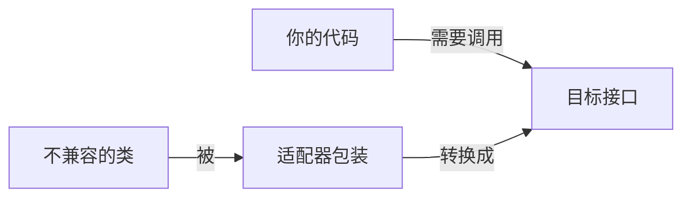

# 适配器模式

> 适配器模式（Adapter Pattern）是一种**结构型**设计模式。

## 作用

让不兼容的接口或类在不修改原有代码的情况下能够协同工作。

## 场景

> 在现实生活中，充电器的电源适配器就是很常见的例子。

当你想使用某个类或第三方库，发现它的接口与系统代码不匹配，且又无法直接修改它的代码时，出现了**接口不兼容**的场景。

1. 数据格式转换：数据提供方提供的内容格式为 XML，第三方数据分析库要求的格式为 JSON。
2. 整合第三方库：不同供应商的 API 接口不一致，但系统业务逻辑需要统一调用。
3. 多版本接口兼容：新版本 v2 接口不兼容老版本 v1 客户端。
4. 跨平台/设备兼容：不同平台（Windows / Linux）提供的 API 存在差异。

## 实现

> 加中间层，转换接口，解决“牛头不对马嘴”的问题。

1. 创建一个中间类（适配器），把不兼容的接口转换成目标接口。
2. 客户端只和适配器打交道，不用关心背后具体怎么实现。

## 优缺点

### 优点

1. 不需要修改已有代码即可使用新类；
2. 符合开闭原则（对扩展开放，对修改关闭）。

### 缺点

1. 代码整体复杂度增加