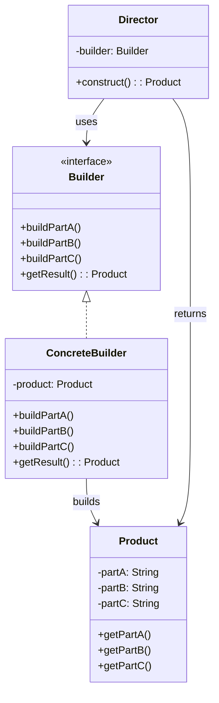
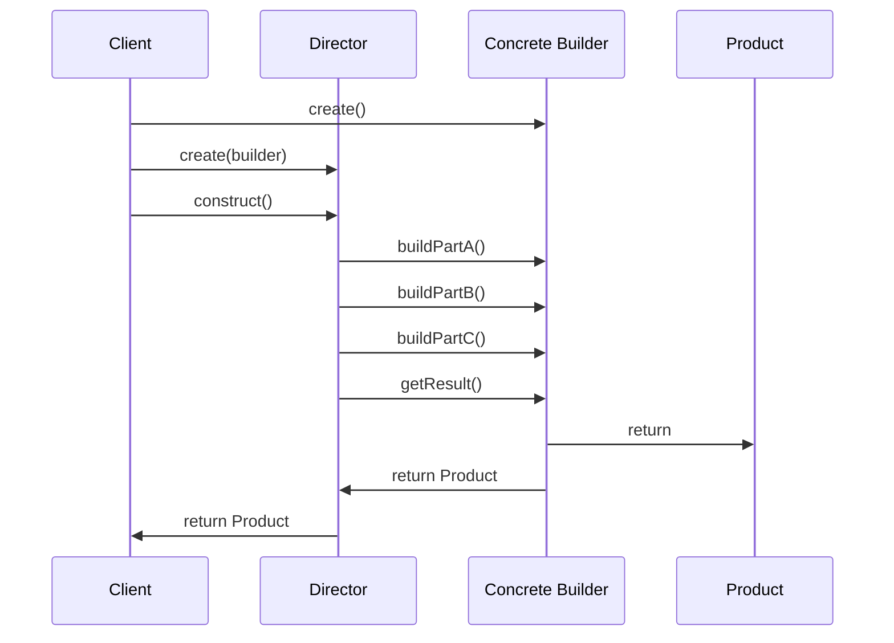

# 建造者模式

> 建造者模式（Builder Pattern）是一种**创建型**设计模式。

## 作用

将一个复杂对象的构建与它的表示分离，使得同样的构建过程可以创建不同的表示。

## 场景

> 当需要创建复杂对象，且对象的构建过程需要多个步骤，或者需要支持不同配置时。

1. **复杂对象构建**：配置对象（数据库配置、HTTP 客户端配置）、复杂实体对象（订单、用户信息）。
2. **链式调用**：流式 API 设计、查询构建器（SQL Builder、MongoDB Query Builder）。
3. **不可变对象**：创建不可变对象，通过建造者逐步设置属性，最后构建。
4. **参数可选且多**：构造函数参数过多时，使用建造者模式提高可读性。
5. **对象变体**：同一构建过程可以创建不同表示的对象（如不同配置的电脑）。
6. **框架设计**：Spring Boot 的 `ApplicationBuilder`、OkHttp 的 `Request.Builder`。

## 核心角色

- **产品（Product）**：被构建的复杂对象，包含多个组成部分。
- **抽象建造者（Builder）**：定义构建产品各个部分的抽象方法。
- **具体建造者（Concrete Builder）**：实现 `Builder` 接口，实现构建产品各个部分的具体方法，提供获取最终产品的方法。
- **指挥者（Director）**：可选角色，负责调用建造者的方法，按照特定顺序构建产品。

## 实现

> 将复杂对象的构建过程分解为多个步骤，通过建造者逐步构建，最后返回完整对象。

1. **定义产品类（Product）**：包含需要构建的各个部分。

2. **定义抽象建造者（Builder）**：声明构建产品各个部分的抽象方法，以及获取最终产品的方法。

3. **实现具体建造者（Concrete Builder）**：
   - 实现 `Builder` 接口
   - 维护产品对象的引用
   - 实现各个构建方法
   - 实现获取最终产品的方法

4. **创建指挥者（Director）**：可选，封装构建过程，按照特定顺序调用建造者的方法。

5. **客户端使用**：创建建造者，通过建造者逐步构建产品，或通过指挥者构建产品。

## 优缺点

### 优点

1. **分离构建与表示**：将复杂对象的构建过程与表示分离，使构建过程更加清晰。
2. **灵活构建**：可以灵活地构建不同配置的对象，支持链式调用。
3. **代码可读性**：使用建造者模式可以避免构造函数参数过多，提高代码可读性。
4. **符合开闭原则**：新增产品变体只需添加新的建造者，无需修改现有代码。

### 缺点

1. **代码复杂度增加**：需要创建多个类（产品、建造者、指挥者），增加了代码复杂度。
2. **内存开销**：建造者需要维护产品对象的引用，可能增加内存开销。
3. **适用场景有限**：对于简单对象，使用建造者模式可能过度设计。

## 对比其它模式

1. **工厂模式**：工厂模式关注的是对象的创建，而建造者模式关注的是复杂对象的构建过程。工厂模式通常创建简单对象，建造者模式创建复杂对象。
2. **抽象工厂模式**：抽象工厂模式创建一系列相关对象，而建造者模式构建一个复杂对象的不同部分。

## 一句话总结

建造者模式通过**将复杂对象的构建过程分解为多个步骤，通过建造者逐步构建**，实现了构建与表示的分离，提高了代码的可读性和灵活性。
