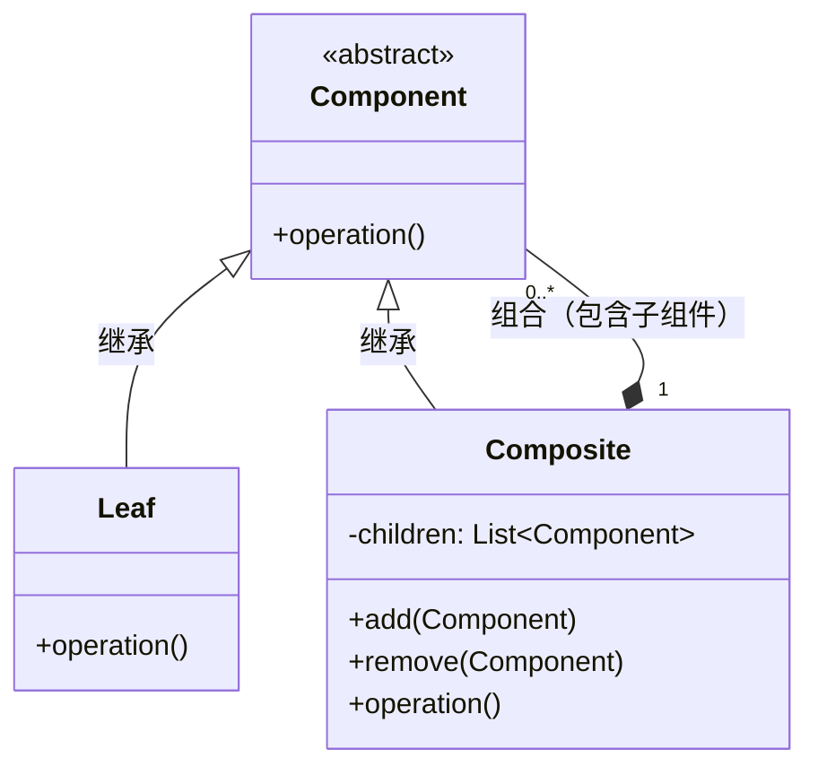

# 组合模式

> 组合模式（Composite Pattern）是一种**结构型**设计模式。

## 作用

方便客户端可以统一地处理单个对象和对象的组合。

## 场景

> 希望客户端忽略组合对象与单个对象的差异，表现层次结构的场景。

1. 文件系统：文件夹（Composite）可以包含文件（Leaf）或其它子文件夹。
2. 图形界面：窗口（Composite）可以包含按钮、文本框、面板等（Leaf），甚至嵌套其他容器。
3. 菜单系统：菜单（Composite）可以包含子菜单或菜单项（Leaf）。
4. 组织架构：部门（Composite）可以包含多个员工（Leaf）或子部门。

## 核心角色

- 组件（Component）：定义所有对象（叶子节点和容器节点）的通用接口，包含一些公共行为或属性。
- 叶子（Leaf）：实现 `Component` 接口，没有子节点，是树结构的基本元素。
- 容器（Composite）：实现 `Component` 接口，并存储子 `Component` 对象集合，用于管理子节点（例如：添加、删除、遍历等……）

## 实现

> 定义统一的组件接口或抽象类，让叶子对象（Leaf）和容器对象（Composite）共享这个接口，通过递归结构处理部分-整体关系。

1. 定义组件 `Component`：声明所有对象共有的操作。
2. 创建叶子节点 `Leaf`：实现基本功能，不包含子节点。
3. 创建容器节点 `Composite`：实现与 `Leaf` 节点相同的接口，并维护一组子组件，支持添加、删除等操作。
4. 客户端使用：无需区分叶子或容器，统一通过组件 `Component` 接口操作。

## 优缺点

### 优点

1. 简化客户端代码：可以一致地处理对象和对象组合，简化上层逻辑。
2. 扩展性强：容易扩展新的树形结构。

### 缺点

1. 设计较抽象，需提前规划好层次结构。
2. 过度统一性可能违反“单一职责原则”（需权衡）。

## 一句话总结

通过**树形结构**🌲统一处理单个对象和组合对象，**让客户端无需区分部分与整体**。