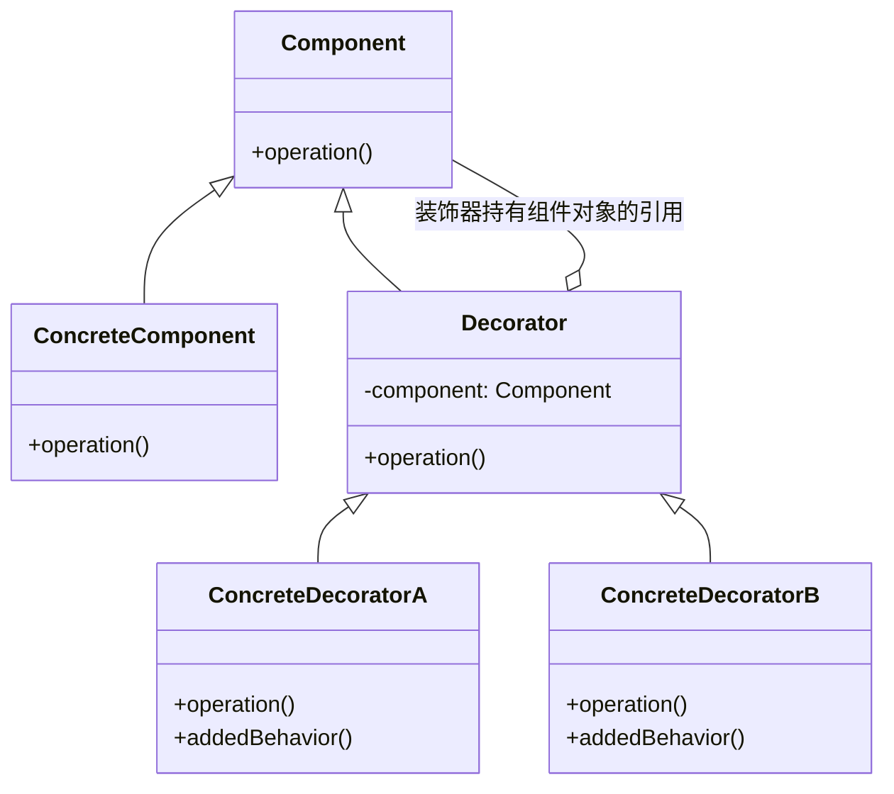

# 装饰模式

> 装饰模式（Decorator Pattern）是一种**结构型**设计模式。

## 作用

在不改变对象结构的情况下，动态地给对象添加新的职责（功能），提供比继承灵活的扩展能力。

## 场景

> 需要动态、透明地为对象添加或撤销功能，或当继承无法灵活扩展时（如子类组合爆炸）。

1. Java I/O 流处理：装饰模式最经典的使用场景之一，使用多个流进行功能组合：
    - 数据类型读取：`FileInputStream` + `DataInputStream`
    - 缓冲：`FileInputStream` + `BufferedInputStream`
    - 压缩：`FileOutputStream` + `GZIPOutputStream`
2. Web 框架中间件：在 `Express.js`、`Django` 等 Web 框架中，每个中间件都可以在不修改核心业务逻辑的情况下添加额外功能：
    - 身份验证中间件
    - 日志记录中间件
    - 跨域处理中间件
    - 请求压缩中间件
3. GUI 组件：为可视化组件动态添加边框、滚动条、阴影等功能。
4. 游戏开发中的角色装备系统：游戏角色通过装备动态叠加技能或属性。
5. 文本/数据格式化工具：为文本动态添加格式化功能（如加粗、高亮、加密等）。

## 核心角色

- 抽象组件（Component）：定义原始对象和装饰类的通用接口，动态地为这些对象添加职责。
- 具体组件（Concrete Component）：实现了 `Component` 接口，是被装饰的原始对象。
- 抽象装饰器（Decorator）：继承或实现 `Component` 接口，持有一个 `Component` 对象的引用。
- 具体装饰器（Concrete Decorator）：扩展 `Decorator` 类，负责向 `Component` 添加新的职责。

## 实现

> 创建一个包装对象（装饰器）来包裹真实的对象，从而在不修改原有类的前提下扩展其功能。



1. 定义抽象组件 `Component`：创建一个接口或抽象类，定义需要被装饰的对象的基本行为。

   ```java
   public interface Component {
       void operation();
   }
   ```

2. 创建具体组件 `Concrete Component`：实现抽象组件 `Component`，作为被装饰的原始对象。

   ```java
   public class ConcreteComponent implements Component {
       @Override
       public void operation() {
           System.out.println("执行基本操作");
       }
   }
   ```

3. 创建抽象装饰器 `Decorator`：实现抽象组件 `Component`，并持有一个组件 `Component` 对象的引用。

   ```java
   public abstract class Decorator implements Component {
       protected Component component;
   
       public Decorator(Component component) {
           this.component = component;
       }
   
       @Override
       public void operation() {
           component.operation();
       }
   }
   ```

4. 创建具体装饰器 `Concrete Decorator`：继承抽象装饰器 `Decorator`，添加具体的装饰功能。

   ```java
   /**
    * 具体装饰器 A
    */
   public class ConcreteDecoratorA extends Decorator {
       public ConcreteDecoratorA(Component component) {
           super(component);
       }
       
       @Override
       public void operation() {
           super.operation();
           addedBehaviorA();
       }
       
       private void addedBehaviorA() {
           System.out.println("添加功能A");
       }
   }
   
   /**
    * 具体装饰器 B
    */
   public class ConcreteDecoratorB extends Decorator {
       public ConcreteDecoratorB(Component component) {
           super(component);
       }
       
       @Override
       public void operation() {
           super.operation();
           addedBehaviorB();
       }
       
       private void addedBehaviorB() {
           System.out.println("添加功能B");
       }
   }
   ```

5. 客户端使用：创建对象并进行装饰。

   ```java
   public class Client {
       public static void main(String[] args) {
           // 创建原始对象
           Component component = new ConcreteComponent();
           
           // 用装饰器A装饰
           Component decoratedA = new ConcreteDecoratorA(component);
           
           // 再用装饰器B装饰（装饰器可以嵌套）
           Component decoratedAB = new ConcreteDecoratorB(decoratedA);
           
           // 执行操作
           decoratedAB.operation();
           /*
            * 输出：
            * 添加功能B
            * 执行基本操作
            * 添加功能A
            */
       }
   }
   ```

## 优缺点

### 优点

1. 可以在不修改原有代码的情况下扩展对象功能。
2. 支持动态添加和撤销功能。
3. 可以用多个装饰器装饰同一个对象。
4. 符合开闭原则。

### 缺点

1. 会产生很多小对象，增加系统复杂性。
2. 装饰链过长时可能影响性能。
3. 调试时比较困难，需要逐层排查。

## 对比其它模式

1. [代理模式](../proxy-pattern)：控制访问，通常只代理一次；**装饰模式可多层嵌套**。
2. [适配器模式](../adapter-pattern)：改变接口；**装饰模式保持接口不变**，增强功能。

## 一句话总结

装饰模式就是**给对象穿“衣服”**：在**不改变原对象**的基础上，通过**嵌套包装**的方式动态添加新功能。