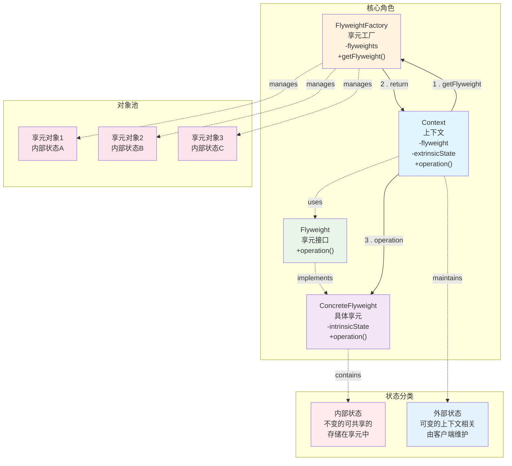

# 享元模式

> 享元模式（Flyweight Pattern）是一种**结构型**设计模式。

## 作用

减少程序中对象的数量，从而降低内存使用。

## 场景

> 需要创建大量结构相似的对象，且这些对象有很多可以共享的属性。

1. 文档编辑类应用：Word、记事本等编辑器中，每个字符对象共享字体、颜色等属性，只有位置信息不同。
2. 游戏开发：大量相同敌人、子弹、粒子效果的渲染。
3. UI 界面开发：网页或应用中大量相同样式的按钮、图标、列表项等组件。
4. 池化技术：虽然不完全等同于享元，但思想类似——复用已有资源，避免频繁创建销毁，本质是享元模式的扩展应用。

## 核心角色

- 享元接口（Flyweight）：定义共享对象的接口，通常包含操作外在状态的方法。
- 具体享元（Concrete Flyweight）：实现 `Flyweight` 接口，存储可以共享的内部不可变状态（如颜色、字体、类型等），这些状态可被多个对象共用。
- 非共享享元（Unshared Concrete Flyweight）：可选项，某些对象不适合共享，可以单独实现 `Flyweight` 接口但不参与共享。
- 享元工厂（Flyweight Factory）：负责创建和管理享元对象，通过缓存（如 `Map`）确保相同内部状态的对象只创建一次，实现复用。

## 实现

> 通过工厂类管理对象池，将对象的不变部分（内部状态）存储在共享的享元对象中。
>
> 而可变部分（外部状态）由客户端传入，从而实现多个上下文共享同一个享元实例。

1. 创建享元接口，声明接受外部状态作为参数的业务方法。
2. 创建具体享元类，存储内部状态，实现接口方法时结合内部状态和传入的外部状态。
3. 建立工厂类管理享元对象池，提供获取享元对象的方法，确保相同内部状态的对象只创建一次。
4. 创建上下文类持有享元对象引用，维护外部状态，提供调用享元对象方法的接口。
5. 客户端通过工厂获取享元对象，创建上下文对象时传入外部状态，调用上下文方法完成业务操作。

## 优缺点

### 优点

1. 性能提升：避免重复创建相同对象；
2. 状态分离：清晰区分内部状态和外部状态

### 缺点

1. 复杂度增加：需要分离内部状态和外部状态。
2. 外部状态需要由客户端维护，管理不当可能出错。

## 一句话总结

通过共享对象的内部状态，减少内存中重复对象的创建，从而提升性能、降低资源消耗。
