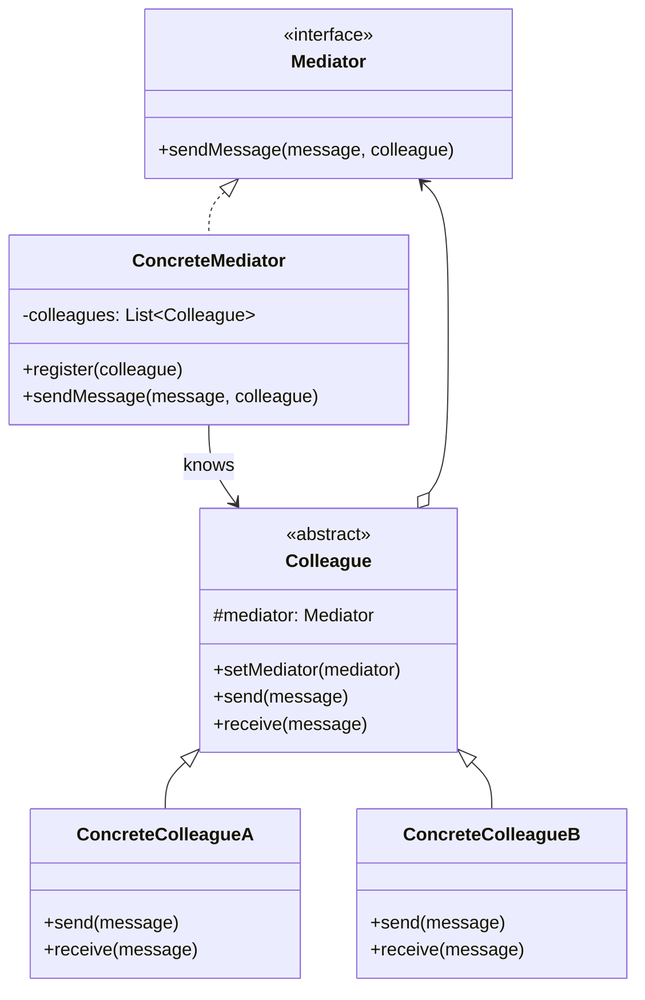
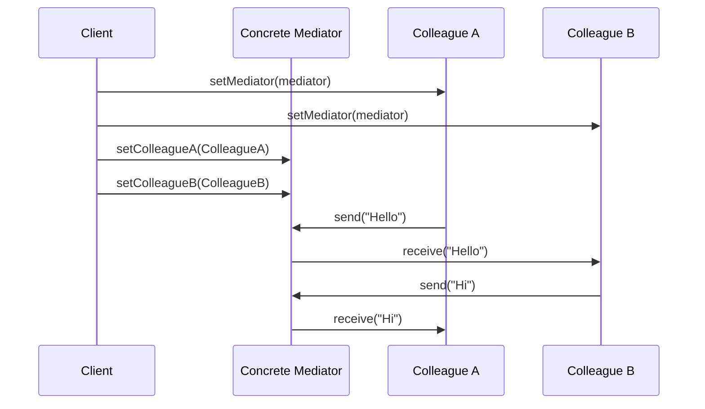
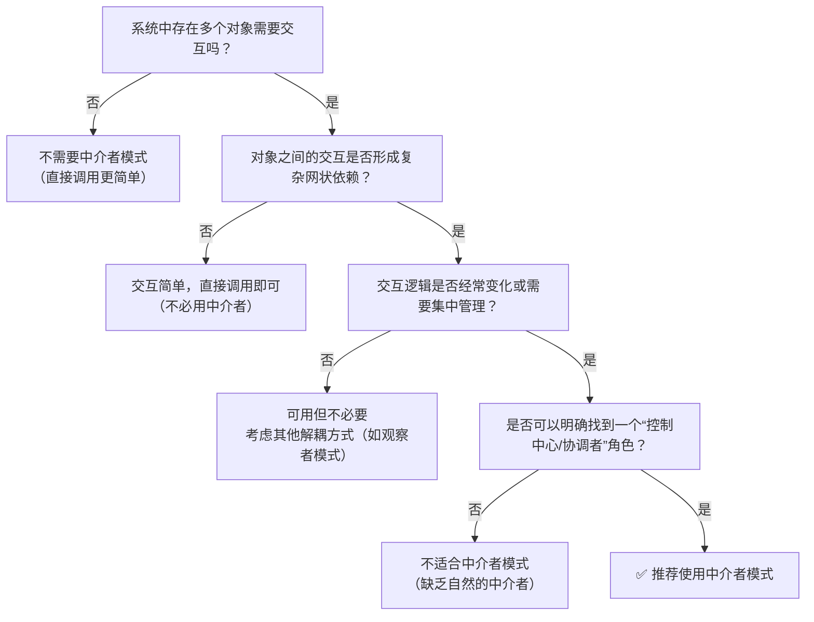

# 中介者模式

> 中介者模式（Mediator Pattern）是一种**行为型**设计模式。

## 作用

让多个对象不用彼此直接通信，而是通过一个“中介者”来协调它们的交互，从而减少耦合，让系统更清晰。

## 场景

> 当系统中有很多对象需要互相通信，而直接通信会导致结构混乱时，就应使用中介者模式，让一个中介者统一协调它们。

1. UI/交互系统：表单联动、弹窗对话框、复杂仪表盘组件协同
2. 通信协作系统：聊天室、会议系统、协同编辑（如腾讯文档）
3. 流程控制系统；工作流引擎、多步骤向导（注册/下单流程）、状态机调度
4. 实时调度系统：航空管制、交通信号协调、游戏房间匹配与同步
5. 模块解耦设计：微服务间轻量协调（配合事件总线更佳）、插件系统通信

## 核心角色

> 同事对象：那些需要互相配合，但不应该彼此直接沟通的参与者。

- 中介者接口（Mediator）：定义“同事对象们”要通过什么方式来沟通。**它是一个规则的抽象**。
- 具体中介者（Concrete Mediator）：**真正负责协调各个对象**，实现了 `Mediator` 接口，持有所有同事对象的引用。
- 同事类接口（Colleague）：**是规则和角色的定义**。每个同事类都知道中介者对象，并通过中介者来发送消息而不是直接发给其他同事。
- 具体同事类（Concrete Colleague）：**具体对象**，实现自身业务；当状态变化时，调用中介者发起协作，不直接调其他同事。

---

1. 同事之间“互不认识” ：各 ConcreteColleague 没有彼此的引用，只认识中介者。
2. 中介者“认识所有人”：ConcreteMediator 持有所有同事的引用，是唯一知道全局关系的角色。

## 实现

> 同事只认中介，中介统筹全局；解耦靠注入，协作靠通知。

1. 定义一个中介者 Mediator：定义一个接口，**统一通信方法**。
2. 实现具体中介者 Concrete Mediator ：实现 `Mediator` 接口，持有同事对象引用，实现真正的“协调”逻辑，**管理同事 & 转发消息**。
3. 定义抽象同事类 Colleague：持有中介者引用，让同事知道中介者。
4. 实现具体同事类 Concrete Colleague：继承 `Colleague`，发送时调用中介者，接收时处理消息，**真正参与通信的对象**。
5. 客户端组装与使用：创建中介者实例 -> 创建同事实例，并将中介者注入 -> 让同事通过中介者交互。

## 优缺点

### 优点

1. 降低耦合度：组件之间不需要直接引用彼此，而是通过中介者进行通信，实现了组件间的解耦。
2. 集中管理交互逻辑：将复杂的交互关系集中到中介者中管理，使得交互逻辑更清晰，便于理解和维护。
3. 简化对象协议：用中介者和各组件间的一对多关系，替代了组件之间复杂的网状多对多关系，简化了通信协议。
4. 提高可复用性：组件不依赖其他具体组件，可以独立复用。只需要配置不同的中介者，就能在不同场景中使用同一个组件。
5. 易于扩展：增加新组件时，只需要让新组件与中介者通信，不需要修改其他组件的代码。

### 缺点

1. 中介者可能过于臃肿：随着系统功能增加，中介者需要处理的交互逻辑越来越多，可能变成一个庞大而复杂的"上帝对象"（God
   Object），难以维护。
2. 单点复杂性与风险：中介者成为系统的核心枢纽，一旦出问题会影响整个交互流程。
3. 性能开销：所有通信都需要经过中介者转发，在某些场景下可能带来额外的性能开销。

## 一句话总结

中介者模式用**集中管理交互换来低耦合和可维护**，但也可能让中介者变成复杂的大管家，所以要权衡使用场景，避免在简单交互中滥用。

