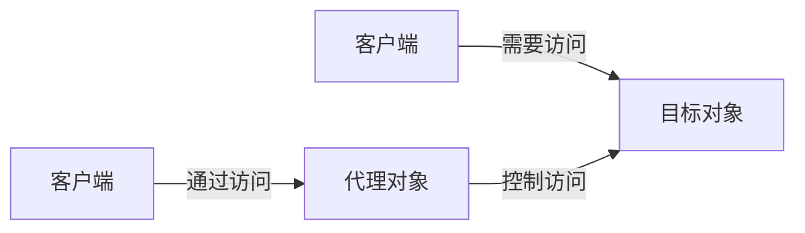

# 代理模式

> 代理模式（Proxy Pattern）是一种**结构型**设计模式。

## 作用

提供一个代理对象来替代另一个对象，从而控制对这个对象的访问。

## 场景

> 适用于需要在不修改原始对象的前提下，对其访问进行控制、增强或封装等场景。

1. 远程调用：目标对象位于远程服务器（如微服务、RPC 调用），代理负责网络通信细节（序列化、传输等）。
2. 权限控制：限制对某些敏感对象的访问，确保只有授权用户才能执行操作。
3. 日志监控：需要在访问目标对象时记录日志、监控性能，但不侵入业务代码。
4. 缓存加速：目标对象的结果可缓存，避免重复计算或请求。
5. 延迟加载：目标对象创建成本很高，可以在真正需要时再加载。
6. 复杂逻辑解耦：`Spring AOP` 切面。
7. 防御性编程：过滤恶意请求或保护目标对象不被滥用，如 API 限流、请求校验。

## 实现

> 通过在客户端和目标对象之间引入一个中间层（代理），以实现额外的功能或控制访问。

### 静态代理

> 手动编写代理类。

1. 定义接口及其实现类。
2. 定义代理类并实现这个接口。
3. 通过代理类对象访问目标类对象。

### 动态代理

> 在运行时动态创建代理对象，无需手动编写代理类。

#### JDK 动态代理

> 利用 `java.lang.reflect.Proxy` 自动生成代理类。

*Spring AOP 默认使用 JDK 动态代理（如果目标类实现了接口）。*

1. 接口与真实类保持不变（同上）。
2. 自定义实现 `InvocationHandler`。

#### CGLIB 动态代理

> 需引入依赖如 cglib 或 Spring 已内置，利用 CGLIB 动态生成一个目标类的子类（代理类）。

*Spring AOP 在没有接口时会自动切换为 CGLIB 动态代理。*

1. 定义目标类（**无需接口**）。
2. 自定义实现 `MethodInterceptor`。
3. 在调用其方法时将控制权交给 `intercept()` 方法，从而实现对方法的增强或拦截。

| 特性              | 静态代理         | JDK 动态代理      | CGLIB 动态代理    |
|-----------------|--------------|---------------|---------------|
| 是否需要接口          | ✅            | ✅             | ❌             |
| 代理类生成方式         | 手动编写         | 运行时动态生成       | 运行时动态生成       |
| 实现原理            | 组合/封装目标对象    | 反射 + 接口       | 字节码操作（ASM）    |
| 代理灵活性           | 差（每个类都要写代理类） | 好             | 好             |
| 性能              | 高（直接调用）      | 较高（反射性能有影响）   | 更高（基于字节码操作）   |
| 使用难度            | 简单           | 中等            | 稍复杂           |
| Spring AOP 默认使用 | ❌            | ✅**有接口**时默认使用 | ✅**无接口**时默认使用 |
| 适用场景            | 小项目或学习       | 拦截接口实现类的方法    | 拦截普通类的方法      |

## 优缺点

### 优点

1. 职责清晰：目标对象只需关注核心逻辑，代理处理附加功能。
2. 扩展性强：新增代理无需修改目标对象，符合开闭原则。
3. 控制访问：代理可以限制或增强对目标对象的操作。

### 缺点

1. 复杂度增加：需额外维护代理类。
2. 性能开销：代理链过长可能影响响应速度。

## 一句话总结

代理模式就是“替身”，它帮你控制对某个对象的访问，并且可以在不修改原始对象的前提下，增加额外功能。