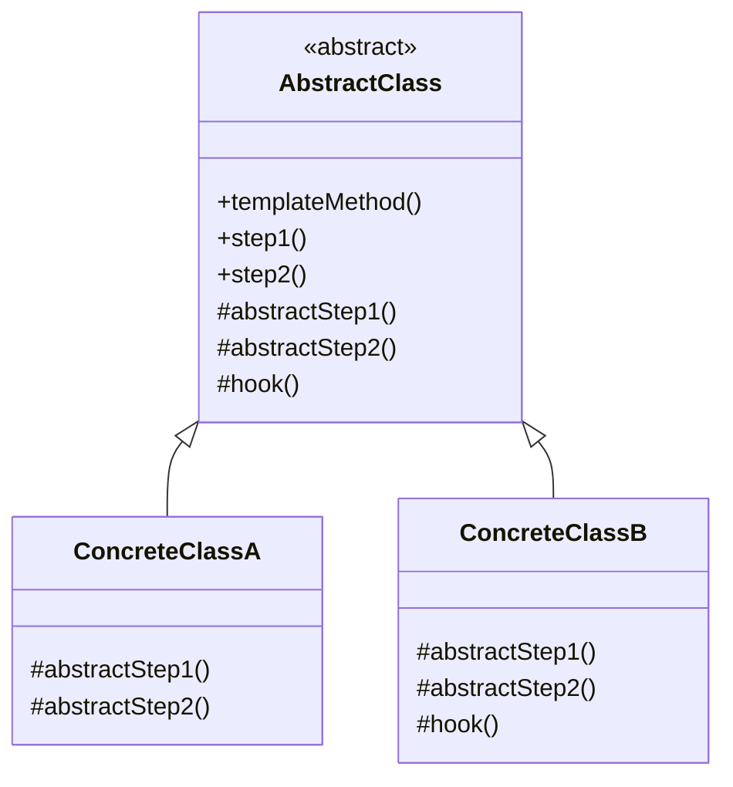
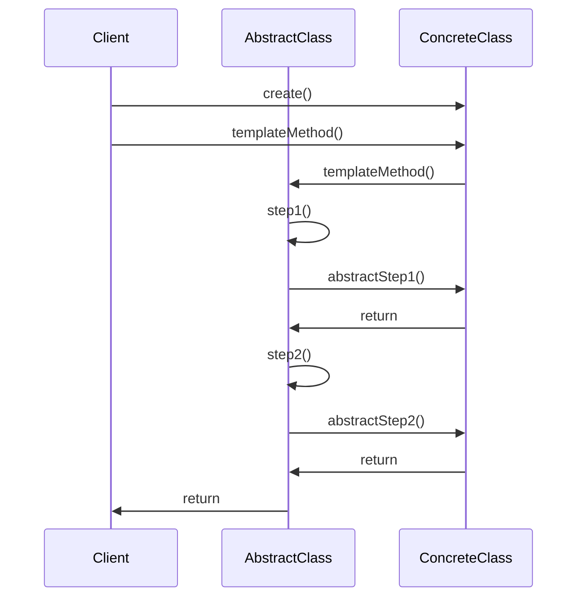

# 模板方法模式

> 模板方法模式（Template Method Pattern）是一种**行为型**设计模式。

## 作用

定义一个操作中算法的骨架，而将一些步骤延迟到子类中。模板方法使得子类可以不改变一个算法的结构即可重定义该算法的某些特定步骤。

## 场景

> 当有多个类包含相似的算法，但某些步骤的实现不同时。

1. **框架设计**：Spring 框架的 `JdbcTemplate`、`RestTemplate`，定义算法骨架，子类实现具体步骤。
2. **流程控制**：数据处理流程（读取 → 处理 → 保存）、工作流引擎、审批流程。
3. **钩子方法**：提供可选的扩展点，子类可以选择性地覆盖某些步骤。
4. **代码复用**：提取公共算法到父类，避免代码重复。
5. **算法变体**：同一算法的不同实现，如不同数据库的连接流程、不同格式的文件处理。
6. **测试框架**：JUnit 的测试生命周期（setUp → test → tearDown）。

## 核心角色

- **抽象类（Abstract Class）**：定义模板方法，实现算法的骨架，声明抽象方法供子类实现。
- **具体子类（Concrete Class）**：实现抽象类中定义的抽象方法，完成算法中特定步骤的实现。

## 实现

> 在抽象类中定义模板方法，实现算法的骨架，将可变部分声明为抽象方法，由子类实现。

1. **定义抽象类（Abstract Class）**：
   - 定义模板方法，实现算法的骨架
   - 声明抽象方法，供子类实现具体步骤
   - 可以提供钩子方法（可选覆盖的方法）

2. **实现具体子类（Concrete Class）**：
   - 继承抽象类
   - 实现抽象方法，完成算法中特定步骤的实现
   - 可以选择性地覆盖钩子方法

3. **客户端使用**：创建具体子类对象，调用模板方法，模板方法会按照定义的顺序调用各个步骤。

## 优缺点

### 优点

1. **代码复用**：将公共算法提取到父类，避免代码重复。
2. **控制子类扩展**：通过模板方法控制算法的结构，子类只能实现特定步骤。
3. **符合开闭原则**：对扩展开放（新增子类），对修改关闭（不修改模板方法）。
4. **提高可维护性**：算法结构集中管理，易于维护和修改。

### 缺点

1. **类数量增加**：每个算法变体都需要一个子类，可能导致类的数量增加。
2. **继承的局限性**：使用继承关系，可能增加类之间的耦合。
3. **灵活性受限**：模板方法固定了算法结构，可能不够灵活。

## 对比其它模式

1. **策略模式**：策略模式通过组合实现算法的替换，而模板方法模式通过继承实现算法的扩展。策略模式更灵活，模板方法模式更简单。
2. **工厂方法模式**：工厂方法模式是模板方法模式的特例，模板方法用于创建对象。

## 一句话总结

模板方法模式通过**在抽象类中定义算法骨架，将可变部分延迟到子类实现**，实现了代码复用和算法的灵活扩展，是框架设计的常用模式。

